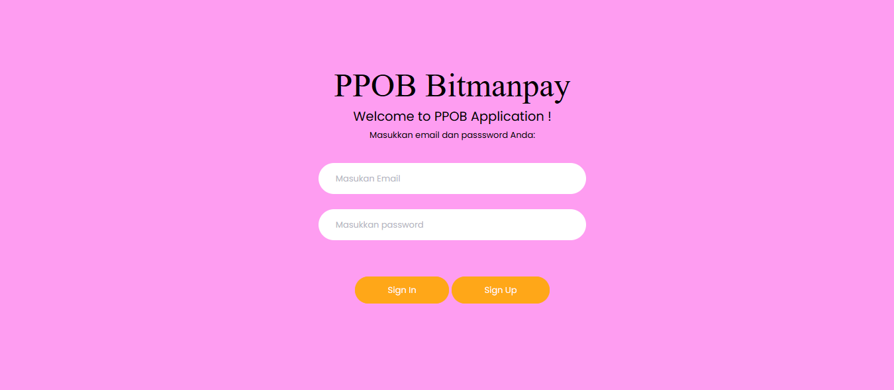
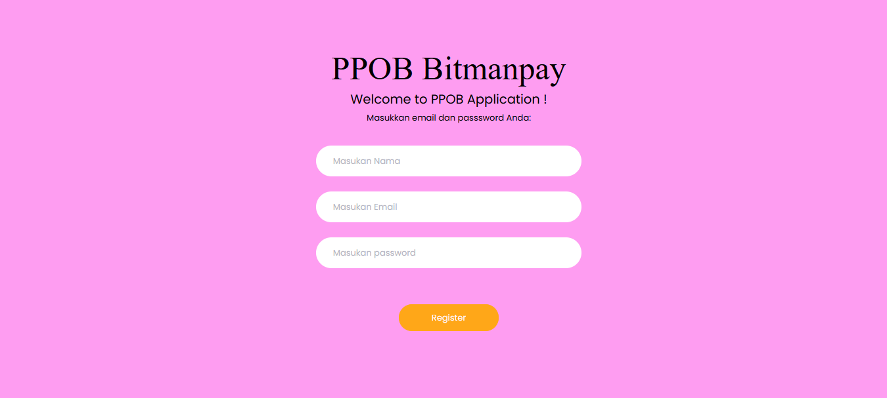
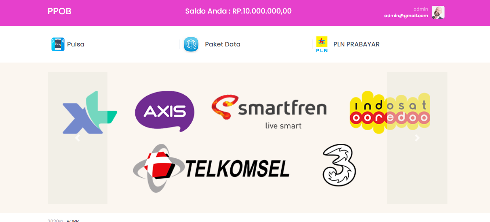
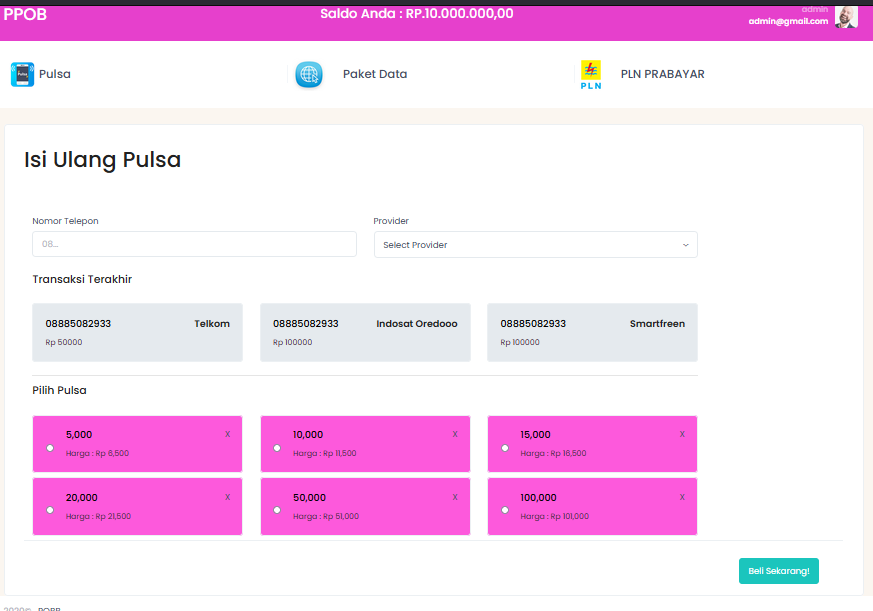
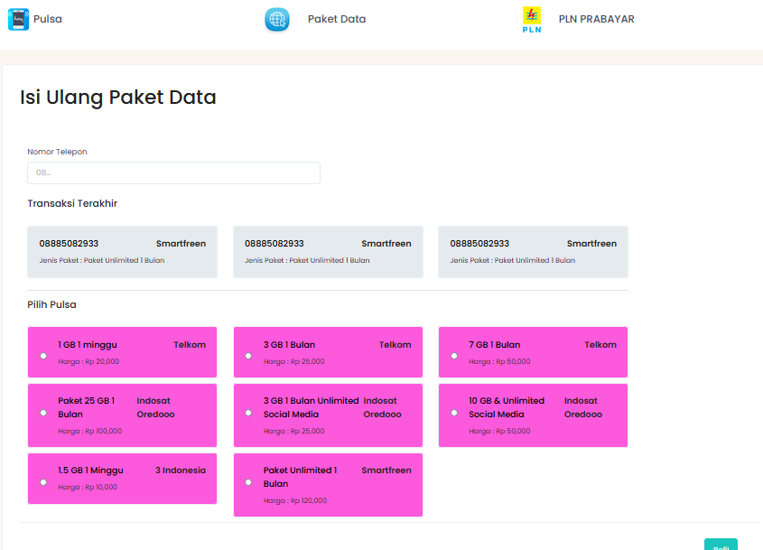
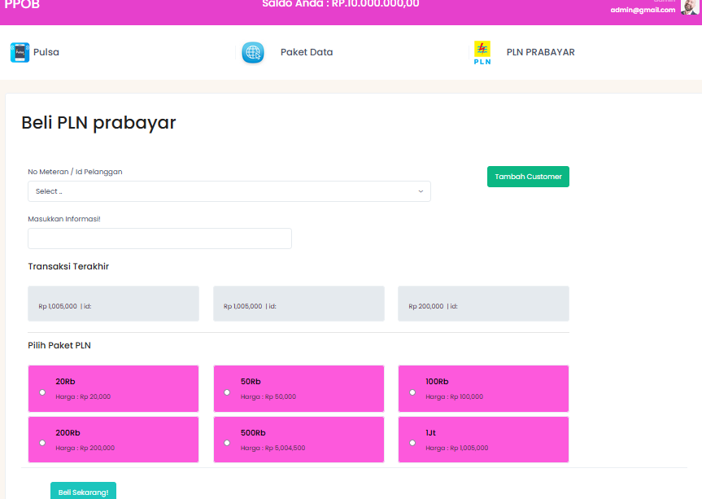
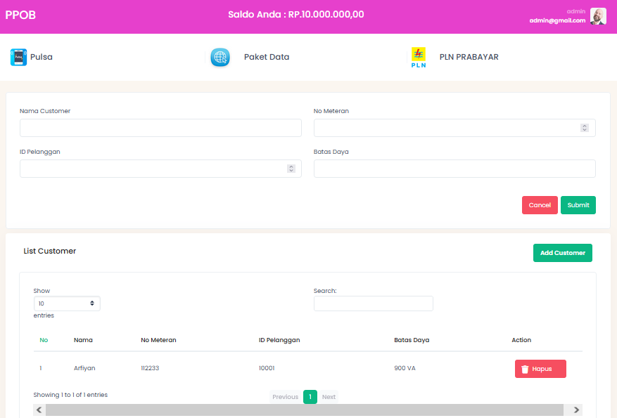

# WEBSITE PPOB "PENJUALAN PULSA,PAKET DATA, PLN PRABAYAR"

**TEKNOLOGI :**

-   BackEnd
    -   Laravel
    -   MySQL
-   FrontEnd
    -   Bootstrap
    -   Metronic
    -   CSS3

**STEP INSTALASI**

-   GIT CLONE https://github.com/Arfiyan19/WEBSITE-PPOB---LARAVEL.git
-   COMPOSER INSTALL
-   CREATE DATABASE dan IMPORT DATABASE db.ppob.sql
- USER DAN PASSWORD
email : admin@gmail.com
pw : admin
-   SETTING .ENV
-   PHP ARTISAN KEY:GENERATE
-   PHP ARTISAN SERVE

**TAMPILAN**

-   HALAMAN LOGIN 
       

-   HALAMAN REGISTER 
       

-   HALAMAN HOME 
       

-   HALAMAN PEMBELIAN PULSA 
       

-   HALAMAN PEMBELIAN PAKET DATA INTERNET 
       

-   HALAMAN PEMBELIAN TOKEN PULSA PLN PRABAYAR 
       

-   HALAMAN CUSTOMERS UNTUK PEMBELIAN TOKEN PULSA PLN 
       

-   HALAMAN SIDE BAR PROFILE  
       
